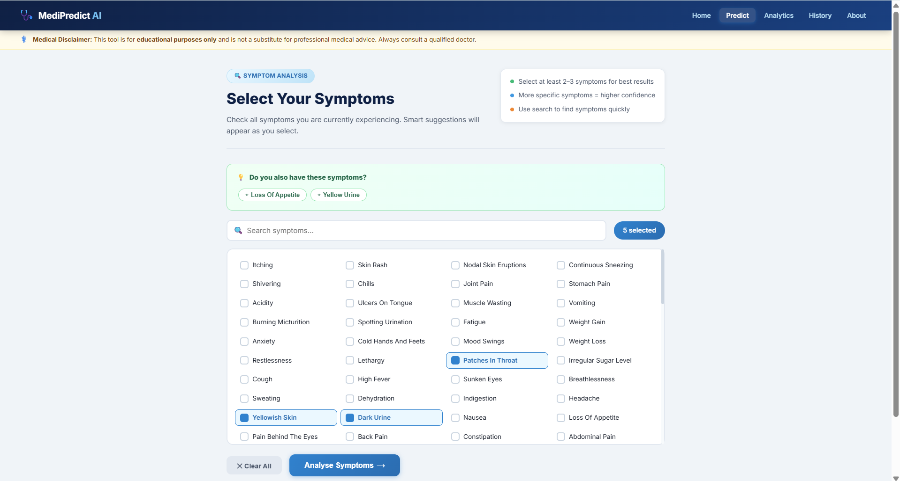
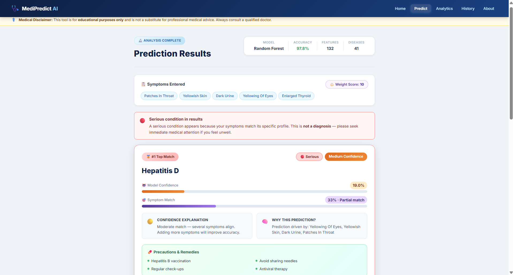

# MediPredict AI - Disease Prediction System

> An end-to-end Machine Learning web application that predicts diseases from user-selected symptoms using Random Forest, Decision Tree, and Naive Bayes classifiers.

---

## Screenshots

### Home Page

### Symptom Selection

### Prediction Results

### Analytics Dashboard

---

## Features

| Feature | Description |
|---|---|
| 3 ML Models | Random Forest (97.8%), Decision Tree (95.1%), Naive Bayes (96.7%) |
| 41 Diseases | Covers common to serious conditions |
| 132 Symptoms | Weighted symptom system for medical realism |
| Safety Gates | Severe diseases only shown with strong symptom match |
| Smart Suggestions | Suggests related symptoms as you select |
| Visual Analytics | EDA plots, confusion matrix, feature importance |
| History | Last 10 predictions saved per session |
| Download Report | Export predictions as a text report |

---

## Tech Stack

- **Backend:** Python 3.11, Flask
- **ML:** Scikit-learn (Random Forest, Decision Tree, Naive Bayes)
- **Data:** Pandas, NumPy
- **Visualizations:** Matplotlib, Seaborn
- **Frontend:** HTML5, CSS3, Vanilla JS

---

## Run Locally

`ash
# 1. Clone the repo
git clone https://github.com/Purvii15/MediPredict-AI.git
cd MediPredict-AI

# 2. Install dependencies
pip install -r requirements.txt

# 3. Train the model (generates model.pkl and plots)
python model.py

# 4. Run the app
python app.py
`

Open **http://127.0.0.1:5000** in your browser.

---

## Project Structure

`
MediPredict-AI/
├── app.py               # Flask web app + REST API
├── model.py             # Train & evaluate all models
├── preprocessing.py     # Data cleaning + EDA plots
├── medical_rules.py     # Symptom weights + safety gates
├── dataset/             # Training.csv, Testing.csv
├── templates/           # HTML pages (Jinja2)
├── static/css/          # Stylesheet
├── static/images/       # Auto-generated plots
└── screenshots/         # UI screenshots
`

---

## Model Performance

| Model | Validation Accuracy |
|---|---|
| Random Forest | **97.8%** |
| Naive Bayes | 96.7% |
| Decision Tree | 95.1% |

> Validation accuracy from 20% internal holdout split (304 unique training samples after deduplication).

---

## Disclaimer

This tool is for **educational purposes only** and is not a substitute for professional medical advice. Always consult a qualified doctor.
